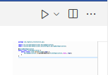
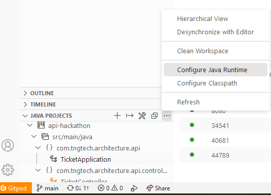
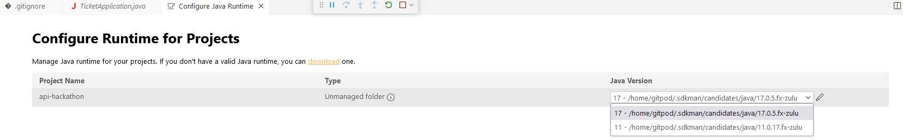

# API Hacking Project

This project is meant to allow to experiment with REST APIs, 
the goal is to inspect the presented API, analyze the problems
and refactor it to be RESTful.

A possible solution can be found in the solution branch.

## Setting up

The project can be run from Gitpod, after starting you need to 
make the 8080 port public.

A postman collection is provided with each of the implemented
APIs. To use the collection import into Postman, and create an
environment in Postman with a variable url and the value of the
address to the public port you create in gitpod.

## Starting the Application

Open the src Folder, and the TicketApplication.java. Gitpod 
should offer you to install the Java Plugins, install those, then
you should see a "Play" button that will start the application.

## Setting Java version

If there are any compiler warnings, the Java version might be wrong.
Make sure it is set to at least 17.
In explorer open the "Java Projects" portion, and choose 
"Configure Java Runtime"

There you need to choose the appropriate java runtime version.

